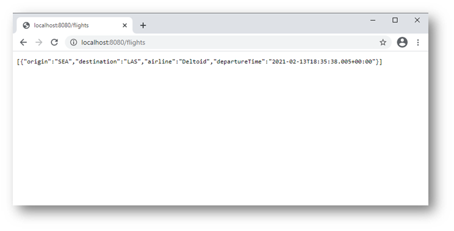
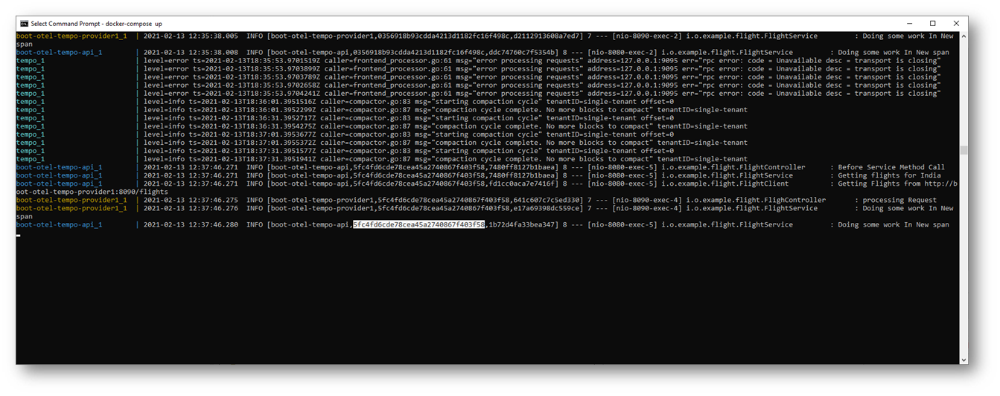
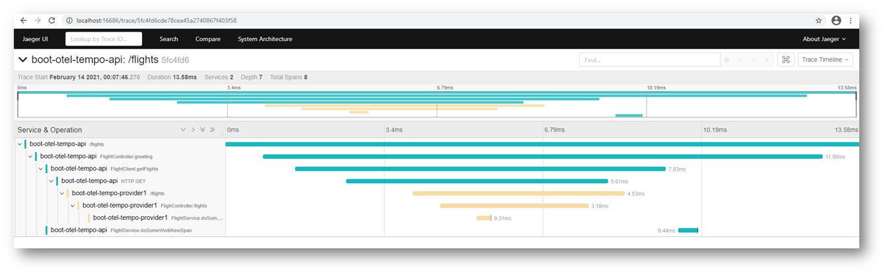
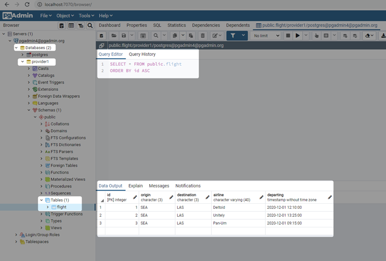

# Project Demonstrating Distribute Tracing

This is a demo project to demonstrate how we can integrate the following

* [Opentelemetry](https://opentelemetry.io/)
* [Grafan Tempo](https://grafana.com/oss/tempo/) Which internally utilized [Jaeger](https://www.jaegertracing.io/)
* [Spring Boot Project](https://spring.io/projects/spring-boot)

# Running


Execute the following on root folder

````bash
mvn clean package docker:build
````

Images

````bash
docker image ls

````


````bash
REPOSITORY                                                      TAG                 IMAGE ID            CREATED              SIZE
mnadeem/boot-otel-tempo-provider1                               0.0.1-SNAPSHOT      7ddceebcc722        About a minute ago   169MB
mnadeem/boot-otel-tempo-api                                     0.0.1-SNAPSHOT      a301242388a1        2 minutes ago        147MB
mnadeem/boot-otel-tempo-docker                                  0.0.1-SNAPSHOT      061a20db744b        4 minutes ago        130MB
````

And then either `docker compose` or `docker stack`

## Docker Compose


````bash
docker-compose up
````

## Docker Stack

````bash
docker swarm init
docker stack deploy --compose-file docker-compose.yaml trace
docker stack services trace
docker stack rm trace
````
# Tracing

Access the endpoint



Copy the trace id



Get the trace information




# Connecting To Internal DB





# Credits

* [otel-demo](https://github.com/williewheeler/otel-demo)

