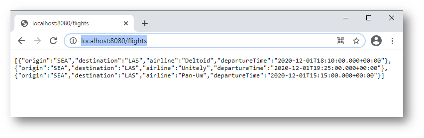
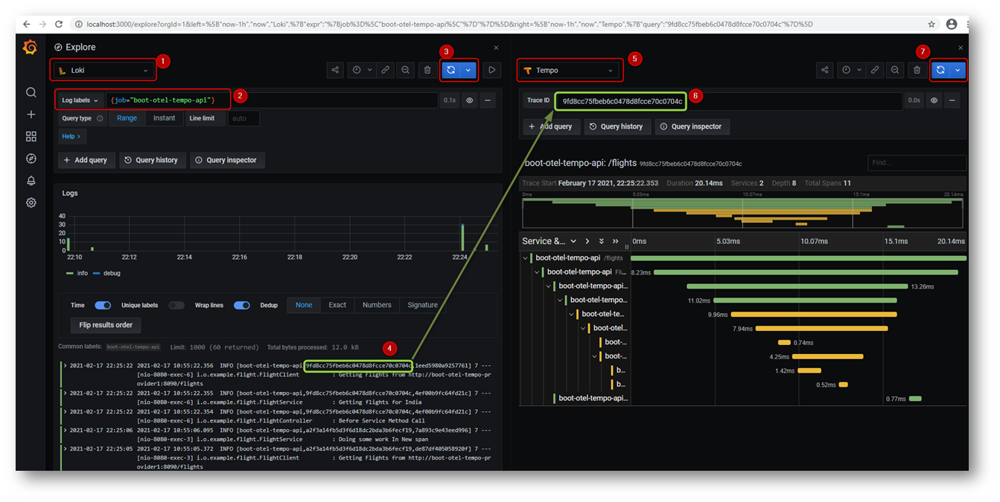
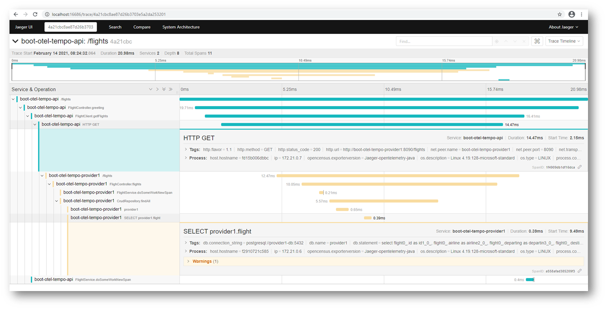
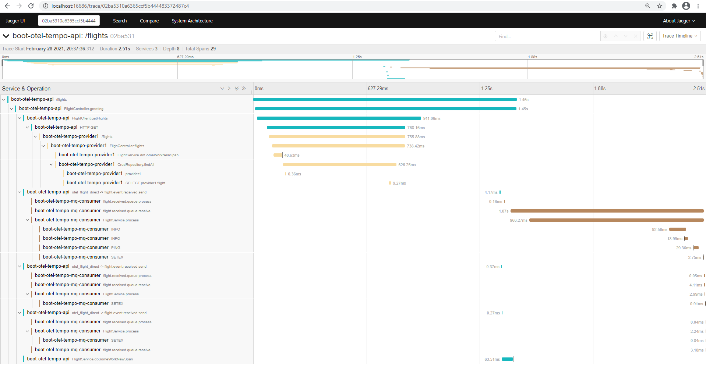
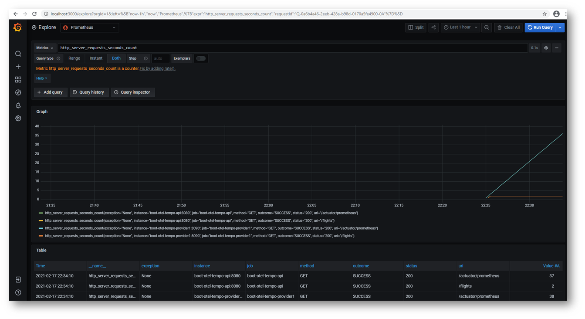
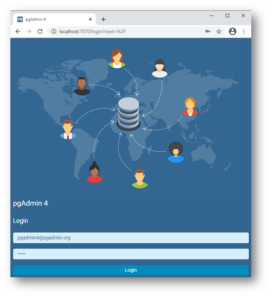
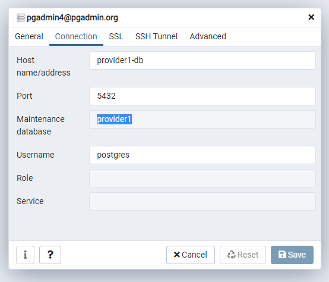

# Project Demonstrating Observability For Java Spring Applications

This project demonstrates Observability using:

* [Prometheus](https://prometheus.io/) for monitoring and alerting
* [Loki](https://grafana.com/oss/loki/) for Distributed Logging
* [Tempo](https://grafana.com/oss/tempo/) for Distributed Tracing
* [Grafan](https://grafana.com/) for visualization

And basically integrates the following

* [Opentelemetry](https://opentelemetry.io/)
* [Grafan Tempo](https://grafana.com/oss/tempo/) Which internally uses [Jaeger](https://www.jaegertracing.io/)
* [Spring Boot Project](https://spring.io/projects/spring-boot)


# Running

Execute the following on root folder

````bash
mvn clean package docker:build
````

Images

````bash
docker image ls

````


````bash
REPOSITORY                                                      TAG                 IMAGE ID            CREATED              SIZE
mnadeem/boot-otel-tempo-provider1                               0.0.1-SNAPSHOT      7ddceebcc722        About a minute ago   169MB
mnadeem/boot-otel-tempo-api                                     0.0.1-SNAPSHOT      a301242388a1        2 minutes ago        147MB
mnadeem/boot-otel-tempo-docker                                  0.0.1-SNAPSHOT      061a20db744b        4 minutes ago        130MB
````

And then either `docker compose` or `docker stack`

## Docker Compose


````bash
docker-compose up
````

## Docker Stack

````bash
docker swarm init
docker stack deploy --compose-file docker-compose.yaml trace
docker stack services trace
docker stack rm trace
````

# Variations 

There are two variations **basic** and **complex**, both version have support for `0.15.0`, `0.16.0` and `0.17.0` in its own branches.

## Basic

Multiple micro-services with **db** and **rest** interactions

## Complex

Multiple micro-services with **db**, **MQ (Rabbit)**, **redis** and **rest** interactions

# Tracing

[Access the endpoint](http://localhost:8080/flights)



View the log and trace in [Grafana](http://localhost:3000/explore)




Get the trace information Using **[Jaeger](http://localhost:16686/search)** as well

**Basic Trace**



**Complex Trace**




# Prometheus Metrics

View the metrics in [prometheus](http://localhost:9090/graph?g0.expr=&g0.tab=1&g0.stacked=0&g0.range_input=1h)


You can view it in [Grafana](http://localhost:3000/explore?orgId=1&left=%5B%22now-1h%22,%22now%22,%22Prometheus%22,%7B%22expr%22:%22http_server_requests_seconds_count%22,%22requestId%22:%22Q-0a6b4a46-2eeb-428a-b98d-0170a5fe4900-0A%22%7D%5D) as well




# Connecting To PostgreSQL DB

[Connect](http://localhost:7070/login?next=%2F)






# Credits

* [otel-demo](https://github.com/williewheeler/otel-demo)
* [java-agent-spring-boot-example](https://github.com/objectiser/java-agent-spring-boot-example)


# Also See
* [Nodejs Opentelemetry Tempo](https://github.com/mnadeem/nodejs-opentelemetry-tempo)